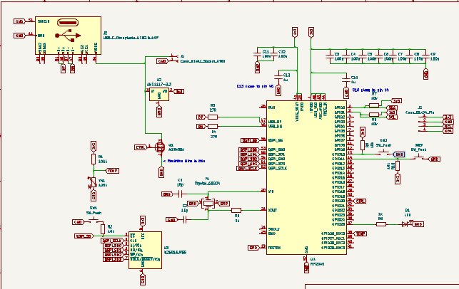
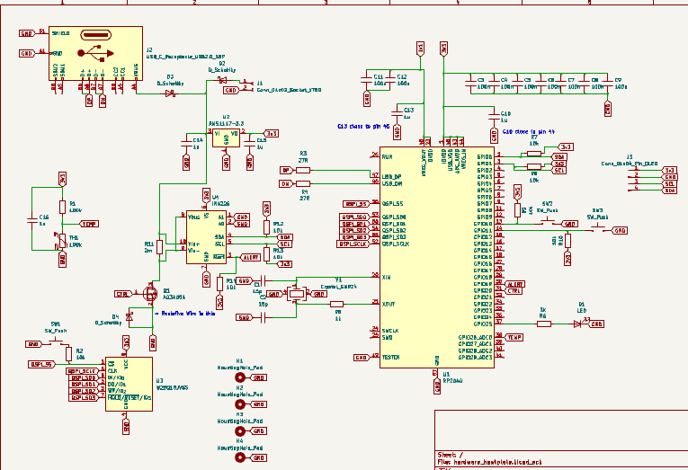
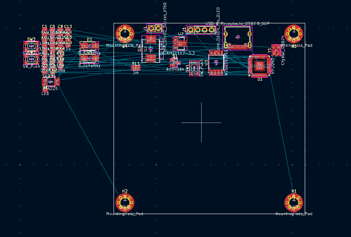

# June 1, 2025

So, i decided to build a PCB hotplate. Yes i had decided to make it before it was put up as ideas on [highway](https://highway.hackclub.com) website.

Yeah so i am gonna start a bit of research.
What i think i need is that first of all a controller(I think i am gonna use the OG RP2040), then i need a mosfet which can handle high current, i would need a voltage regulator for the RP2040, and i would need copper tracks and i would need a thermistor or a temperature sensor. 

Okay, [this](https://www.lcsc.com/product-detail/MOSFETs_UTC-Unisonic-Tech-UT20N03L-TN3-R_C171442.html) is the mosfet i decided to go with. [This](https://www.lcsc.com/product-detail/Voltage-Regulators-Linear-Low-Drop-Out-LDO-Regulators_JSMSEMI-AMS1117S-3-3_C917152.html) is the voltage regulator i decided. Can't find a good thermistor now i'll look tomorrow.

GUESS WHO FOUND [A GOOD THERMISTOR](https://www.lcsc.com/product-detail/NTC-Thermistors_Dersonic-NTDM1003FB39500148_C5355638.html) IN JUST A FEW MINUTES AFTER THE LAST COMMIT BECAUSE I COULDN'T WAIT TILL TOMORROW
### Time Spent: 30 mins
  
--------  

# June 3 2025

Couldn't work yesterday cuz i had to study, and now started the journal again cuz i realised that the old mosfet is not compatible with 3.3v from rp2040. so i changed the mosfet and [this](https://www.lcsc.com/product-detail/MOSFETs_Alpha-Omega-Semicon-AO3400A_C20917.html) is the new mosfet now. I will be controlling it using PWM.  

And um yeah i also wanted to tell that i will be using thermistor for calculating temperature of the plate. this will be done using a voltage divider network, probably a 10k ohm resistor connected to ground and other side connected to thermistor and thermistor connected to 3.3v, and the voltage divider junction will be connected to rp2040 to measure temperature.  

I will be using a similar technique to measure the input voltage, like i can use a resistor divider to measure voltage which will thus help in controlling MOSFET. Probably gonna use PID.  

That's all for now
#### Time spent this session: 10 mins

Um Okay, i forgot to mention this, but i am also gonna use an [OLED](https://roboticsdna.in/product/1-3-inch-iic-128x64-oled-display-module-4-pin-blue/), and two [buttons](https://www.lcsc.com/product-detail/Others_C-K-PTS810SJK250SMTRLFS_C221896.html) (Push button), i wanna make it like pinecil....

Okay, i think most of the things are done in the schematic, here it is(btw i assigned a few footprints too):  

Btw what i was thinking is that PID would be
overkill for this, i think a normal algorithm
(PID minus ID, means only proportional) would be
0K. But i am going to try PID too!!  
And Somehow i have to find a way to figure out
the resistance of the Big PCB trace, and i
thought of going with 5cm x 6cm PCB trace Area,
and i will try to make the whole board in 6.5cm
x 6.5cm...
### Total Time Spent Today: 2 hours 10 mins

# June 5 2025

It's 4:30 AM. Gonna start working on the project, i am in the call right now.

I need a current sensor to Measure the current going through the coil. So, [this](https://www.lcsc.com/product-detail/Current-Sensors_Allegro-MicroSystems-LLC-ACS712ELCTR-20A-T_C10681.html) is the current sensor i found.  

Curent Sensor changed. Current Current sensor is the [TI INA226](https://www.lcsc.com/product-detail/Current-Sense-Amplifiers_Texas-Instruments-INA226AIDGSR_C49851.html)

Okay, i worked on the schematic a bit, and now i will probably start with the PCB.

Completed the schematic:

### Total Time Spent This session(the call): 2 hours 30 mins

I dont think i am gonna work anymore today so here is the total time spent today(i am really tired as the call was at 4:30 AM for me, i had to wake up way early(4 hours early than usual))